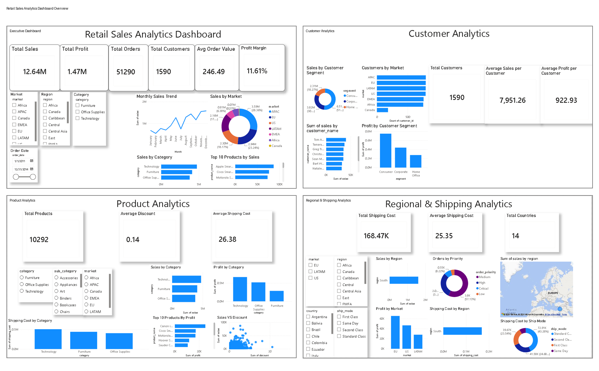
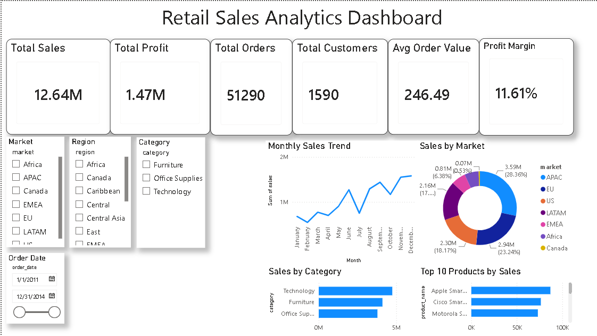
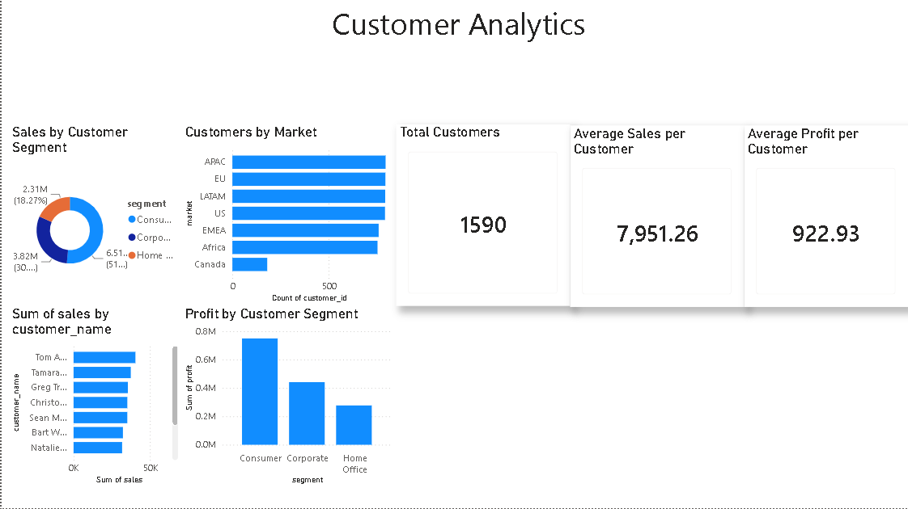
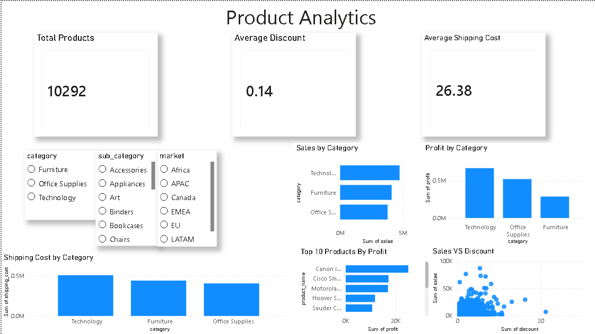
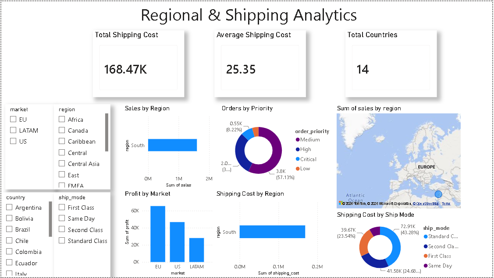

# 🛍️ Retail Sales Analytics Platform

A complete end-to-end Retail Sales Analytics project that transforms raw retail transaction data into actionable business insights using Python, PostgreSQL, SQL, and Power BI.

This project demonstrates the complete analytics pipeline, including data exploration, preprocessing, database integration, SQL-based business analysis, and interactive dashboard development.

---

# 📌 Project Overview

The objective of this project is to analyze a global retail sales dataset and provide meaningful insights into sales performance, customer behavior, product profitability, and regional business trends.

The project follows a real-world analytics workflow:

Raw Dataset
→ Data Cleaning (Python)
→ Data Transformation
→ PostgreSQL Database
→ SQL Business Analysis
→ Power BI Dashboard

---

# 🚀 Features

- Data Cleaning & Preprocessing using Pandas
- Exploratory Data Analysis (EDA)
- PostgreSQL Database Integration
- SQL Business Queries
- Interactive Power BI Dashboard
- Customer Analytics
- Product Performance Analysis
- Regional Sales Analysis
- Shipping Analytics
- KPI Dashboard
- Dynamic Filters & Slicers

---

# 🛠️ Tech Stack

| Technology | Purpose |
|------------|---------|
| Python | Data Cleaning & Analysis |
| Pandas | Data Manipulation |
| NumPy | Numerical Operations |
| PostgreSQL | Relational Database |
| SQLAlchemy | Database Connection |
| SQL | Business Queries |
| Power BI | Dashboard & Visualization |
| DAX | KPI Measures |

---

# 📂 Project Structure

```text
Retail-Sales-Analytics/
│
├── dashboard/
│   └── Retail_Sales_Dashboard.pbix
│
├── data/
│   ├── raw/
│   │   └── Global Superstore.xlsx
│   └── processed/
│       └── global_superstore_clean.csv
│
├── notebooks/
│   ├── 01_data_exploration.ipynb
│   ├── 02_data_cleaning.ipynb
│   └── 03_postgresql_sql_analysis.ipynb
│
├── sql/
│   ├── create_tables.sql
│   ├── insert_data.sql
│   └── business_queries.sql
│
├── screenshots/
│   ├── dashboard_overview.png
│   ├── executive_dashboard.png
│   ├── customer_analytics.png
│   ├── product_analytics.png
│   └── regional_shipping.png
│
│
├── requirements.txt
│
└── README.md
```

---

# 📊 Dashboard Pages

## Executive Dashboard

Provides a high-level overview of business performance.

### KPIs

- Total Sales
- Total Profit
- Total Orders
- Total Customers
- Average Order Value
- Profit Margin

### Visualizations

- Monthly Sales Trend
- Sales by Market
- Sales by Category
- Top Products by Sales

---

## Customer Analytics

Analyzes customer purchasing behavior.

### KPIs

- Total Customers
- Average Sales per Customer
- Average Profit per Customer

### Visualizations

- Sales by Customer Segment
- Customers by Market
- Top Customers
- Profit by Customer Segment

---

## Product Analytics

Evaluates product performance.

### KPIs

- Total Products
- Average Discount
- Average Shipping Cost

### Visualizations

- Sales by Category
- Profit by Category
- Top Products by Profit
- Sales vs Discount
- Shipping Cost by Category

---

## Regional & Shipping Analytics

Analyzes geographical and logistics performance.

### KPIs

- Total Shipping Cost
- Average Shipping Cost
- Total Countries

### Visualizations

- Sales by Region
- Profit by Market
- Sales by Country
- Shipping Cost by Ship Mode
- Shipping Cost by Region
- Orders by Priority

---

# 📸 Dashboard Preview

## Dashboard Overview



---

## Executive Dashboard



---

## Customer Analytics



---

## Product Analytics



---

## Regional & Shipping Analytics



---

# 🗄️ Database Workflow

1. Clean raw dataset using Python.
2. Export cleaned CSV.
3. Create PostgreSQL database.
4. Load cleaned dataset into PostgreSQL.
5. Execute SQL business queries.
6. Connect Power BI to PostgreSQL.
7. Build interactive dashboards.

---

# 📈 Business Insights

The dashboard helps answer key business questions, including:

- Which markets generate the highest sales?
- Which product categories are most profitable?
- Who are the top-performing customers?
- How does discount affect sales?
- Which regions incur the highest shipping costs?
- Which shipping modes contribute most to logistics expenses?
- How do customer segments differ in profitability?

---

# ⚙️ Installation

## Clone Repository

```bash
git clone https://github.com/Castilloshaji/Retail-Sales-Analytics.git
```

---

## Install Dependencies

```bash
pip install -r requirements.txt
```

---

## PostgreSQL

Create a PostgreSQL database and execute:

- create_tables.sql
- insert_data.sql
- business_queries.sql

---

## Power BI

Open:

```
dashboard/Retail_Sales_Dashboard.pbix
```

Refresh the PostgreSQL connection if necessary.

---

# 🎯 Skills Demonstrated

- Data Cleaning
- Data Preprocessing
- Exploratory Data Analysis
- SQL Querying
- PostgreSQL
- ETL Pipeline
- Data Modeling
- Business Intelligence
- Power BI
- DAX
- Dashboard Design
- Data Visualization

---

# 📚 Dataset

Global Superstore Dataset

This dataset contains retail transaction records including:

- Orders
- Customers
- Products
- Markets
- Regions
- Shipping
- Profit
- Sales

---

# 👨‍💻 Author

**Castillo Shaji**

AI & ML Undergraduate

Interested in:

- Data Analytics
- Data Engineering
- Machine Learning
- Business Intelligence
- AI Applications

---

# ⭐ If you found this project useful, consider giving it a Star!
